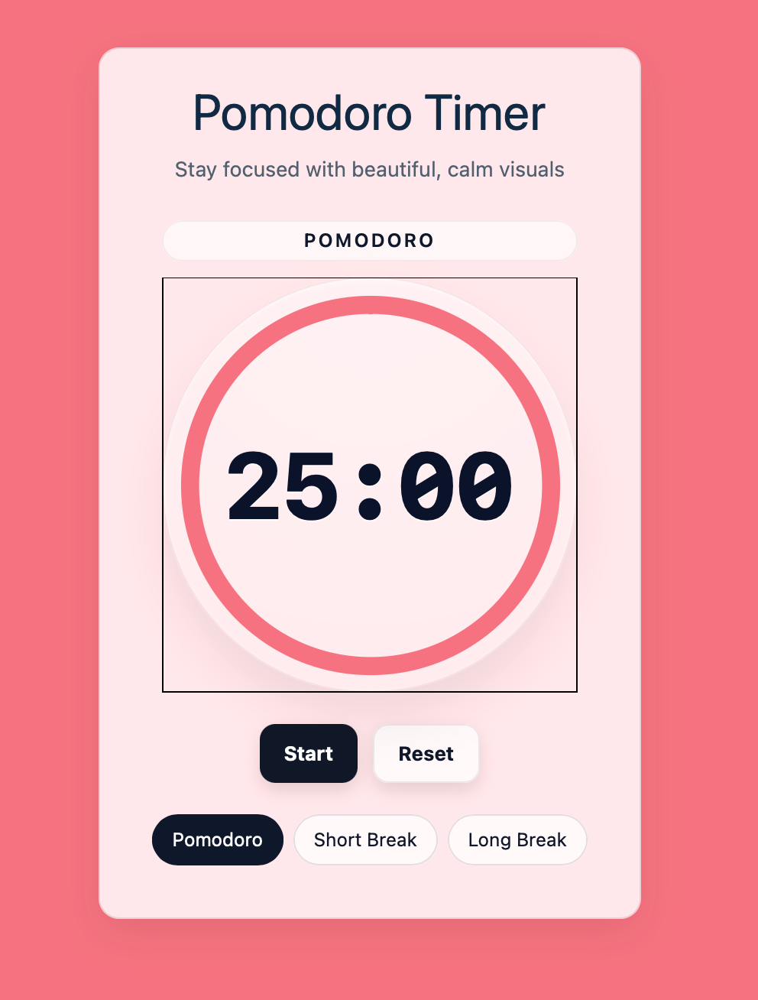
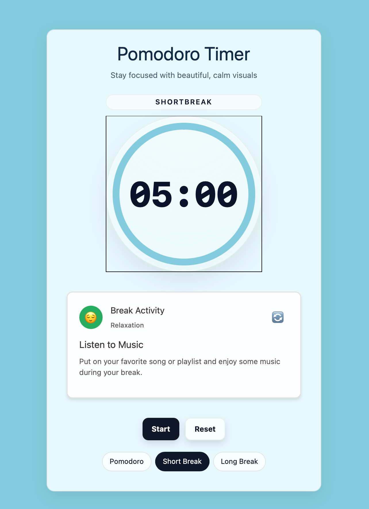
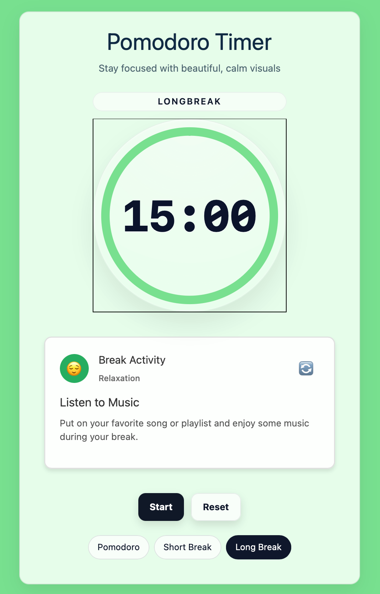

# Pomodoro App (Svelte)

Beautiful, theme-aware Pomodoro app with multi-page UX, animated backgrounds, and Safari-safe theme color.

<p align="center">
	
	<br/>
	<em>Pomodoro</em>
</p>

<p align="center">
	
	<br/>
	<em>Short Break</em>
</p>

<p align="center">
	
	<br/>
	<em>Long Break</em>
</p>

## Creating a project

If you're seeing this, you've probably already done this step. Congrats!

```sh
# create a new project in the current directory
npx sv create

# create a new project in my-app
npx sv create my-app
```

## Developing

Once you've created a project and installed dependencies with `npm install` (or `pnpm install` or `yarn`), start a development server:

```sh
npm run dev

# or start the server and open the app in a new browser tab
npm run dev -- --open
```

## Building

To create a production version of your app:

```sh
npm run build
```

You can preview the production build with `npm run preview`.

> To deploy your app, you may need to install an [adapter](https://svelte.dev/docs/kit/adapters) for your target environment.

## Screenshots

CI captures three screenshots on every push/PR and uploads them as an artifact. They’re also saved in `docs/screenshots` when generated locally.

To generate locally:

```sh
pnpm build
pnpm preview --port 4173 &
PREVIEW_URL=http://127.0.0.1:4173 node scripts/generate-screenshots.mjs
```

In CI, see workflow `.github/workflows/screenshots.yml` and the uploaded artifact named `app-screenshots`.
